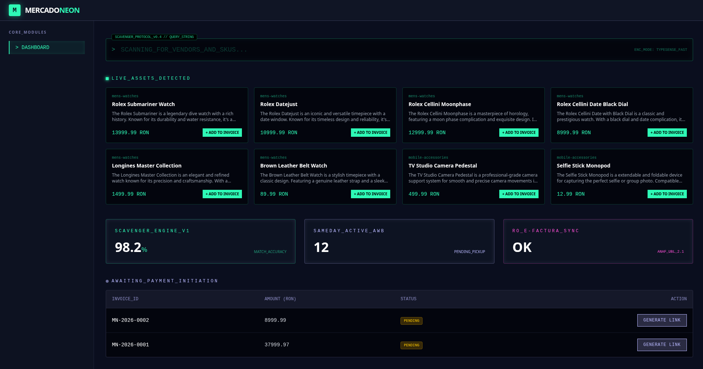

# Mercado Neon

Laravel 11 Vue 3 Python / FAISS Stripe

**Mercado Neon** is a high-performance, polyglot e-commerce ecosystem. It moves beyond traditional CRUD applications by integrating a **Retrieval-Augmented Generation (RAG)** search engine and a specialized microservice for Romanian **e-Factura (ANAF)** compliance.

## 🏗 Polyglot Architecture

The system is engineered as a containerized suite of services, ensuring that heavy mathematical computations and external compliance logic do not block the primary user experience.

- **The Core (Laravel 11, Inertia.js, Vue 3):** The central nervous system handling business logic, user sessions, and the reactive frontend.
- **AI Vector Engine (Python & FAISS):** A high-performance microservice providing semantic product discovery via intent-based embeddings.
- **Compliance Microservice (Node.js & TypeScript):** An isolated service for UBL 2.1 XML generation and ANAF SPV system integration.

## 🚀 Key Engineering Features

### 1\. AI-Powered RAG Search

- **GenerateProductEmbedding:** A background job that triggers on product updates to keep the vector space current.
- **Semantic Retrieval:** The `RagSearchController` queries the FAISS engine to return items based on mathematical similarity.

### 2\. Event-Driven Payments (Stripe)

- **Asynchronous Processing:** Stripe Webhooks update order statuses securely in the background.
- **Decoupled Logic:** The `PaymentConfirmed` event automates secondary tasks like inventory and invoicing.

## 🔧 Setup & Installation

    # Start the container stack
    docker compose up -d --build

    # Initialize application
    docker compose exec app composer install
    docker compose exec app php artisan migrate --seed

## 📂 Project Structure

    ├── backend/               # Laravel Core (The Monolith)
    ├── vector-engine/         # Python AI microservice
    ├── efactura-microservice/ # TypeScript compliance service
    └── docker/                # Orchestration configurations

## 📄 License

This project is open-source under the **MIT license**.
